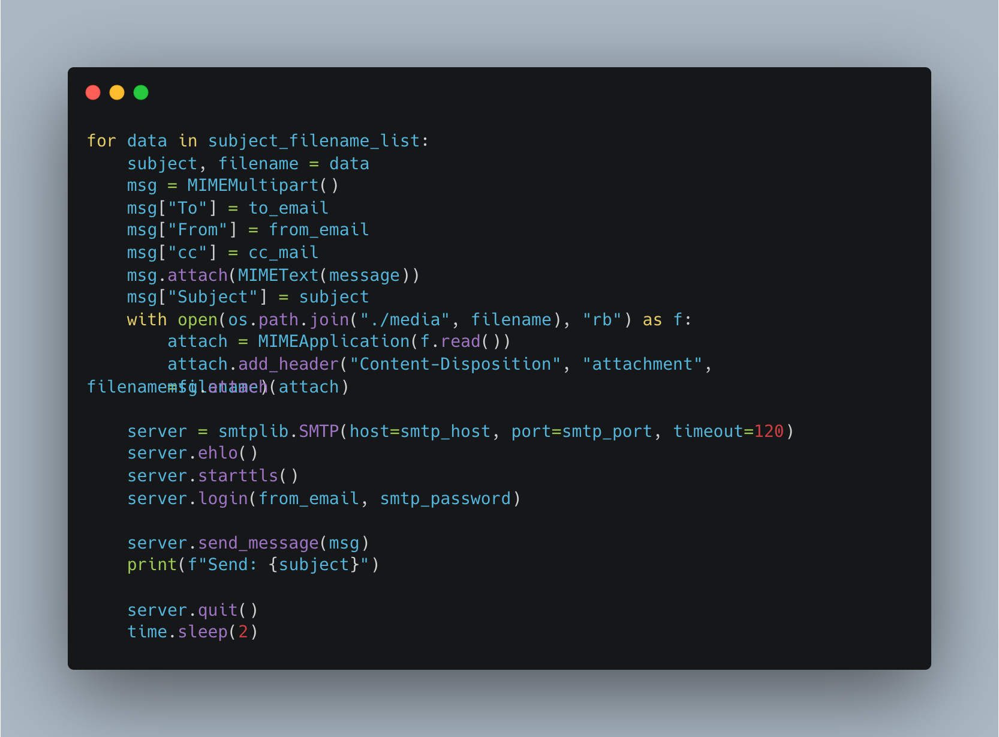

# 100 Days Of Code - Log

## Day 0: May 18, 2025

### Today's Progress

- 100DaysOfCode を始める
- 自動メール送信ツールの改善
- メール取得後の処理バグ修正
- 破損ファイルを OCR にかけた時のエラーハンドリング
- システムのテスト
  - UIUX
  - 負荷試験
  - その他機能・非機能テスト

### Thoughts

- 同じタイトルのようなメールを送った時にメールサーバ側の仕様でまとまった形になりそのままだと送信元の情報が取得できなかったりする。
- 破損ファイルを OCR(GCP CloudVisionAPI)に投げるとエラーになることがわかった。例外ケースだけど追加対応
- QA チーム等が独立して存在するプロジェクト等のありがたみを痛感。自分でやるとやっぱり結構工数とる。

### Link or Image to work

