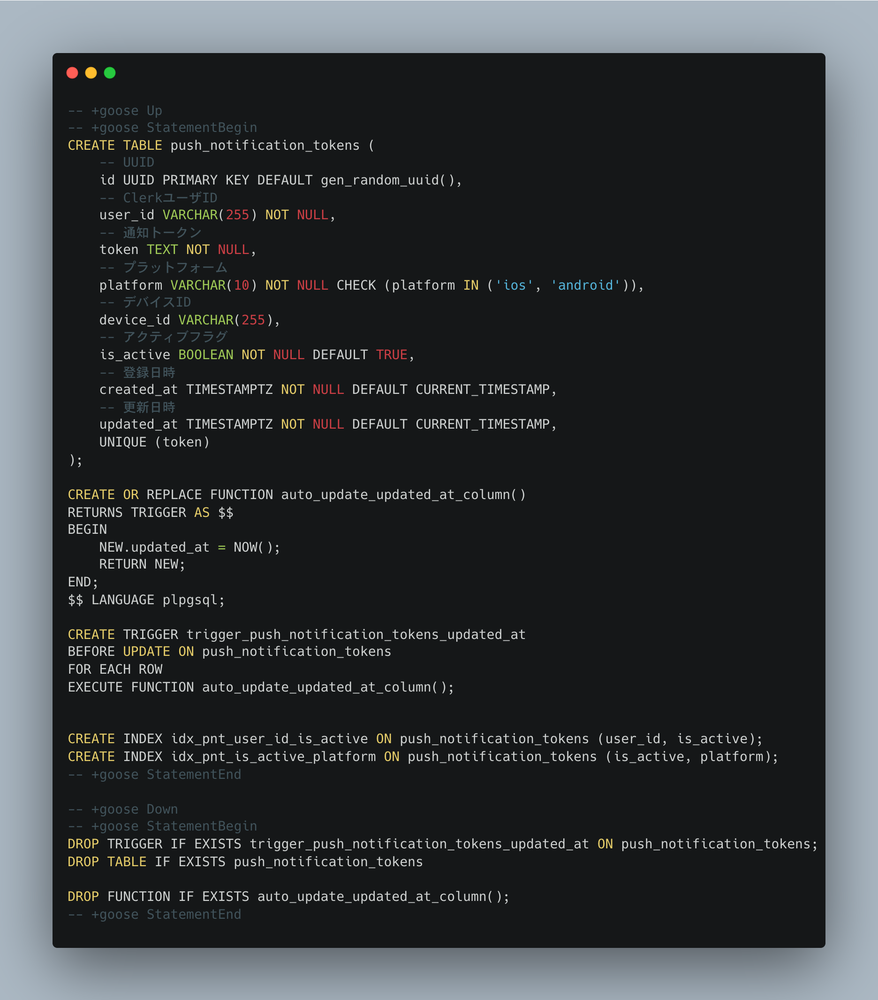

# 100 Days Of Code - Log

## Day 3: May 20, 2025

### Today's Progress

- DB 設計
- 管理用に README 整備
- PostgreSQL に自動で更新日を導入する関数の導入と INDEX 設計

### Thoughts

- 意外と生の SQL を書いて Migration ファイルを作成するみたいなことが今まで多くなかったので、今更になってドキュメントを見返したりして勉強になる。楽しい。

### Link or Image to work

Push 通知 Token 管理用のテーブル(migration ファイル本来は 2 つだが 1 つにまとめています)

